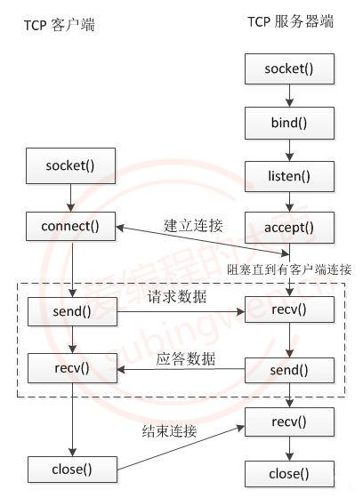

# socket 网络编程

文章查看连接：
https://subingwen.cn/linux/socket/#5-2-3-%E5%A5%97%E6%8E%A5%E5%AD%97%E5%87%BD%E6%95%B0

https://blog.csdn.net/dongliqiang2006/article/details/5824651

## TCP 通讯流程


socket ----> 应用层

bing() -----> 传输层 <------TCP 协议

listen() -----> 网络层

accept() -----> 网络接口层

### TCP

面向连接：是一个双向连接，通过三次握手完成，断开连接需要通过四次挥手完成。
安全：tcp 通信过程中，会对发送的每一数据包都会进行校验, 如果发现数据丢失, 会自动重传
流式传输：发送端和接收端处理数据的速度，数据的量都可以不一致

## 服务器通讯流程

1.创建用于监听的套接字, 这个套接字是一个文件描述符
文件描述符(有两种 1.监听，2.通讯)

`int lfd = socket();`
服务器不会主动发送请求，使用套接字来 监听有没有新的客户端连接

2.将得到的监听的文件描述符和本地的 IP 端口进行绑定

`bind();`

3.设置监听(成功之后开始监听, 监听的是客户端的连接)

`listen();`

4.等待并接受客户端的连接请求, 建立新的连接, 会得到一个新的文件描述符(通信的)，没有新连接请求就阻塞

`int cfd = accept();`

5.通信，读写操作默认都是阻塞的

// 接收数据
`read(); / recv();`

// 发送数据
`write(); / send();`

6.断开连接, 关闭套接字（调用四次挥手）
`close();`

## 客户端通讯流程

4.2 客户端的通信流程
在单线程的情况下客户端通信的文件描述符有一个, 没有监听的文件描述符

1.创建一个通信的套接字
`int cfd = socket();`

2.连接服务器, 需要知道服务器绑定的 IP 和端口
`connect();`

3.通信
// 接收数据
`read(); / recv();`

// 发送数据
`write(); / send();`

4.断开连接, 关闭文件描述符(套接字)

`close();`

## socket server 函数

#### socket

相关使用文档: https://www.nowcoder.com/discuss/353150083384418304

`int socket(int domain, int type, int protocol) ;`

第一个参数：IP 地址类型，AF_INET 表示使用 IPv4，如果使用 IPv6 请使用 AF_INET6。

第二个参数：数据传输方式，SOCK_STREAM 表示流格式、面向连接，多用于 TCP。SOCK_DGRAM 表示数据报格式、无连接，多用于 UDP。

第三个参数：协议，0 表示根据前面的两个参数自动推导协议类型。设置为 IPPROTO_TCP 和 IPPTOTO_UDP，分别表示 TCP 和 UDP。

#### bind()函数

https://wenku.csdn.net/answer/bc86e2bc5df7404fb99f08e900bab6c3

通过 socket()函数已经获得了一个套接字，我们指定了这个套接字的协议簇，语义类型和协议，但还未赋予其具体的地址。因此，需要调用 bind()函数将一个特定地址绑定到 socket 上。

`int bind(int sockfd, const struct sockaddr _addr, socklen_t addrlen);`

sockfd: socket 套接字，通过 socket()创建得到。

```// 在写数据的时候不好用
struct sockaddr {
sa_family_t sa_family; // 地址族协议, ipv4
char sa_data[14]; // 端口(2 字节) + IP 地址(4 字节) + 填充(8 字节)
}

typedef unsigned short uint16_t;
typedef unsigned int uint32_t;
typedef uint16_t in_port_t;
typedef uint32_t in_addr_t;
typedef unsigned short int sa_family_t;
#define \_\_SOCKADDR_COMMON_SIZE (sizeof (unsigned short int))

struct in_addr
{
in_addr_t s_addr;
};

// sizeof(struct sockaddr) == sizeof(struct sockaddr_in)

struct sockaddr*in
{
sa_family_t sin_family; /* 地址族协议: AF*INET */
in*port_t sin_port; /* 端口, 2 字节-> 大端 _/
struct in_addr sin_addr; /_ IP 地址, 4 字节 -> 大端 _/
/_ 填充 8 字节 \_/
unsigned char sin_zero[sizeof (struct sockaddr) - sizeof(sin_family) -
sizeof (in_port_t) - sizeof (struct in_addr)];
};
```

addr: 将 sockfd 绑定的协议地址，一个 const struct sockaddr 结构体的指针。该参数与创建 socket 时的协议簇相关联： -1. AF_INET 即 ipv4 时：int 变量(4Byte)能表示一个 ip 地址

-addrlen：地址结构体的长度

#### listen()函数

`int listen(int sockfd, int backlog); `

当在第二步完成对 socket 的地址绑定后，服务端需要调用 listen()来监听 socket，处于监听状态下的 socket 便可以接受客户端的连接、断开请求。

sockfd: socket 套接字，通过 socket()和 bind()得到。
backlog: socket 的未完成连接队列长度，坚持一瞬间的访问 最大是 128(定死)
返回值： 监听成功返回 0，否则返回小于 0。

#### accept()函数 (阻塞函数（当没有新的客户端连接，默认为阻塞的）)

每次只能对一个客户端建立连接

`int accept(int sockfd, struct sockaddr *addr, socklen_t *addrlen);`

sockfd: listen 监听的套接字；
addr: 连接到 listen sockfd 的客户端地址指针；
addrlen: 地址长度
返回值：成功建立连接返回大于 0 的正整数代表内核创建的 sockfd，异常时返回-1；

#### 接收数据

`ssize_t read(int sockfd, void *buf, size_t size);
ssize_t recv(int sockfd, void *buf, size_t size, int flags);`

参数:
sockfd: 用于通信的文件描述符, accept() 函数的返回值
buf: 指向一块有效内存, 用于存储接收是数据
size: 参数 buf 指向的内存的容量
flags: 特殊的属性, 一般不使用, 指定为 0
返回值:
大于 0：实际接收的字节数
等于 0：对方断开了连接
-1：接收数据失败了
`如果连接没有断开，接收端接收不到数据，接收数据的函数会阻塞等待数据到达，数据到达后函数解除阻塞，开始接收数据，当发送端断开连接，接收端无法接收到任何数据，但是这时候就不会阻塞了，函数直接返回 0。`

## socket cilent 客户端

### 发送数据

`ssize_t write(int fd, const void *buf, size_t len);
ssize_t send(int fd, const void *buf, size_t len, int flags); `

参数:
fd: 通信的文件描述符, accept() 函数的返回值
buf: 传入参数, 要发送的字符串
len: 要发送的字符串的长度
flags: 特殊的属性, 一般不使用, 指定为 0
返回值：
大于 0：实际发送的字节数，和参数 len 是相等的
-1：发送数据失败了

### connect() 函数

connect()函数顾名思义，由主动的(客户端) cilent socket 向被动 server socket 发起连接请求，因此 connect 函数中的 cilent 被称为主动 socket，同理 listen 函数处理后的 server 为被动 socket。

`int connect(int sockfd, const struct sockaddr *addr, socklen_t addrlen);`

sockfd: 主动 socket，即客户端向服务器通信的 socket；注意不是被动 socket。
addr: 与 bind()函数的地址一致，为服务端 socket 的地址。
addrlen: 地址长度。
返回值: 连接成功返回 0，否则返回值小于 0。

`注意：man手册对connect()函数返回值的描述，If the connection or binding succeeds, zero is returned. 为什么bind()会出现在connect返回值描述中呢？因为对于客户端来说，它的socket不需要主动进行bind()调用去绑定一个端口，在connect()调用时候系统会隐形执行bind()，绑定的地址为：系统分配的端口和本机的ip。`

## socket 拓展

https://subingwen.cn/linux/socket/#5-1-%E5%88%9D%E5%A7%8B%E5%8C%96%E5%A5%97%E6%8E%A5%E5%AD%97%E7%8E%AF%E5%A2%83

### 初始化套接字环境

```
 ///////////////////////////////////////////////////////////////////////
/////////////////////////////// Windows ///////////////////////////////
///////////////////////////////////////////////////////////////////////
typedef struct in_addr {
　　union {
　　	struct{ unsigned char s_b1,s_b2, s_b3,s_b4;} S_un_b;
　　	struct{ unsigned short s_w1, s_w2;} S_un_w;
　　	unsigned long S_addr;	// 存储IP地址
　　} S_un;
}IN_ADDR;

struct sockaddr_in {
　　short int sin_family; /* Address family */
　　unsigned short int sin_port; /* Port number */
　　struct in_addr sin_addr; /* Internet address */
　　unsigned char sin_zero[8]; /* Same size as struct sockaddr */
};

/////////////////////////////////////////////////////////////////////////////////////////////////////Linux ///////////////////////////////////////////////////////////////////////////////////////////////////////
typedef unsigned short  uint16_t;
typedef unsigned int    uint32_t;
typedef uint16_t in_port_t;
typedef uint32_t in_addr_t;
typedef unsigned short int sa_family_t;

struct in_addr
{
    in_addr_t s_addr;
};

// sizeof(struct sockaddr) == sizeof(struct sockaddr_in)
struct sockaddr_in
{
    sa_family_t sin_family;     /* 地址族协议: AF_INET */
    in_port_t sin_port;         /* 端口, 2字节-> 大端  */
    struct in_addr sin_addr;    /* IP地址, 4字节 -> 大端  */
    /* 填充 8字节 */
    unsigned char sin_zero[sizeof (struct sockaddr) - sizeof(sin_family) -
    sizeof (in_port_t) - sizeof (struct in_addr)];
};

```

### 大小端转换

```
// 主机字节序 -> 网络字节序
u_short htons (u_short hostshort );
u_long htonl ( u_long hostlong);

// 网络字节序 -> 主机字节序
u_short ntohs (u_short netshort );
u_long ntohl ( u_long netlong);

// linux函数, window上没有这两个函数
inet_ntop();
inet_pton();

// windows 和 linux 都使用, 只能处理ipv4的ip地址
// 点分十进制IP -> 大端整形
unsigned long inet_addr (const char FAR * cp);	// windows
in_addr_t     inet_addr (const char *cp);			// linux

// 大端整形 -> 点分十进制IP
// window, linux相同
char* inet_ntoa(struct in_addr in);

```

### 套接字函数

`window的api中套接字对应的类型是 SOCKET 类型, linux中是 int 类型, 本质是一样的`

```
// 创建一个套接字
// 返回值: 成功返回套接字, 失败返回INVALID_SOCKET
SOCKET socket(int af,int type,int protocal);
参数:
    - af: 地址族协议
        - ipv4: AF_INET (windows/linux)
        - PF_INET (windows)
        - AF_INET == PF_INET
   - type: 和linux一样
       	- SOCK_STREAM
        - SOCK_DGRAM
   - protocal: 一般写0 即可
       - 在windows上的另一种写法
           - IPPROTO_TCP, 使用指定的流式协议中的tcp协议
           - IPPROTO_UDP, 使用指定的报式协议中的udp协议

 // 关键字: FAR NEAR, 这两个关键字在32/64位机上是没有意义的, 指定的内存的寻址方式
// 套接字绑定本地IP和端口
// 返回值: 成功返回0，失败返回SOCKET_ERROR
int bind(SOCKET s,const struct sockaddr FAR* name, int namelen);

// 设置监听
// 返回值: 成功返回0，失败返回SOCKET_ERROR
int listen(SOCKET s,int backlog);

// 等待并接受客户端连接
// 返回值: 成功返回用于的套接字，失败返回INVALID_SOCKET。
SOCKET accept ( SOCKET s, struct sockaddr FAR* addr, int FAR* addrlen );

// 连接服务器
// 返回值: 成功返回0，失败返回SOCKET_ERROR
int connect (SOCKET s,const struct sockaddr FAR* name,int namelen );

// 在Qt中connect用户信号槽的连接, 如果要使用windows api 中的 connect 需要在函数名前加::
::connect(sock, (struct sockaddr*)&addr, sizeof(addr));

// 接收数据
// 返回值: 成功时返回接收的字节数，收到EOF时为0，失败时返回SOCKET_ERROR。
//		==0 代表对方已经断开了连接
int recv (SOCKET s,char FAR* buf,int len,int flags);

// 发送数据
// 返回值: 成功返回传输字节数，失败返回SOCKET_ERROR。
int send (SOCKET s,const char FAR * buf, int len,int flags);

// 关闭套接字
// 返回值: 成功返回0，失败返回SOCKET_ERROR
int closesocket (SOCKET s);		// 在linux中使用的函数是: int close(int fd);

//----------------------- udp 通信函数 -------------------------
// 接收数据
int recvfrom(SOCKET s,char FAR *buf,int len,int flags,
         struct sockaddr FAR *from,int FAR *fromlen);
// 发送数据
int sendto(SOCKET s,const char FAR *buf,int len,int flags,
       const struct sockaddr FAR *to,int tolen);


```
